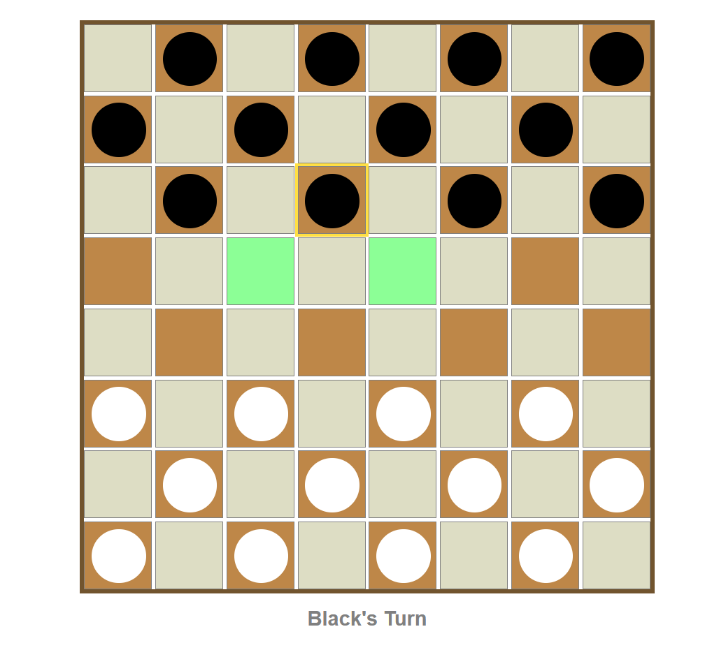

# Checkers-project

# Discription:
This online checkers board game is played on an 8x8 grid, consisting of 64 squares of alternating dark and light colors. Each player starts with 12 checkers placed on the dark squares of their respective sides of the board.

The objective of the game is to capture all of the opponent's checkers or block them from making any legal moves.

Players take turns moving their checkers diagonally to an adjacent empty square. Regular checkers can only move forward diagonally, one square at a time. However, if a player's checker reaches the opponent's back row, it gets promoted to a "king" checker, which can move both forward and backward diagonally.

To capture an opponent's checker, a player must "jump" over it by moving their checker diagonally over an adjacent square and landing on an empty square immediately on the other side.

 The game can provide a graphical user interface where players can click on their checkers and then click on the destination square to make a move. The interface can also highlight valid moves for the selected checker to assist players in making their decisions. it can also keep track of the current turn.

 Overall, this online checkers board game would provide an enjoyable and challenging experience for players of all ages.

# Technologies Used:
 HTML, CSS, and JS.

# Getting Started:
 https://half-checkers.netlify.app/

# Next Steps:
Regrettably, the development of the game could not be completed in its entirety. There are two key aspects that require further attention: removing old pieces and implementing a mechanism to skip occupied spaces.
