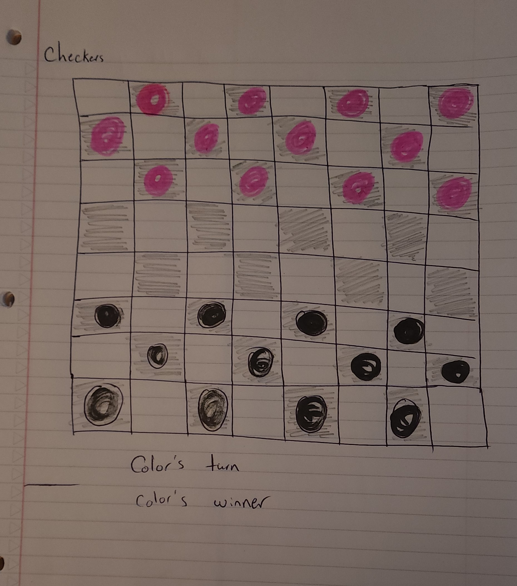

# Checkers-project

overall Pseudocode:
1) Define required constants

2) Define required variables used to track the state of the game

3) Store elements on the page that will be accessed in code more than once in variables to make code more concise, readable and performant.

4) Upon loading the app should:
  4.1) Initialize the state variables
  4.2) Render those values to the page
  4.3) Wait for the user to click a circle, and cell

5) Handle a player clicking a circle

6) Handle the data that is changed after a the cell is clicked

7) Handle a player clicking the restart button
